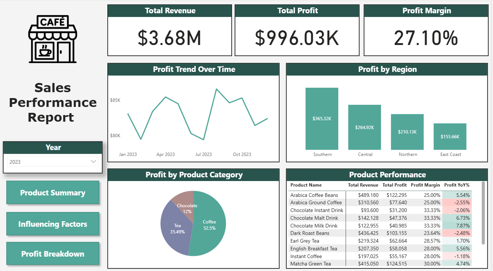
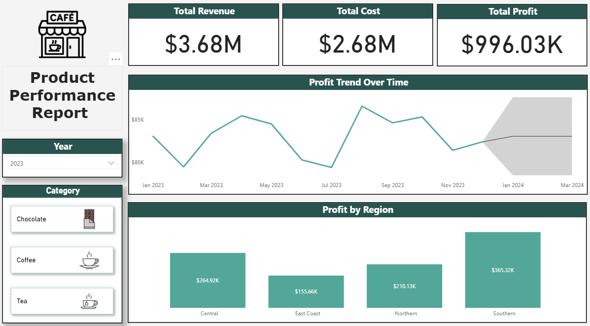
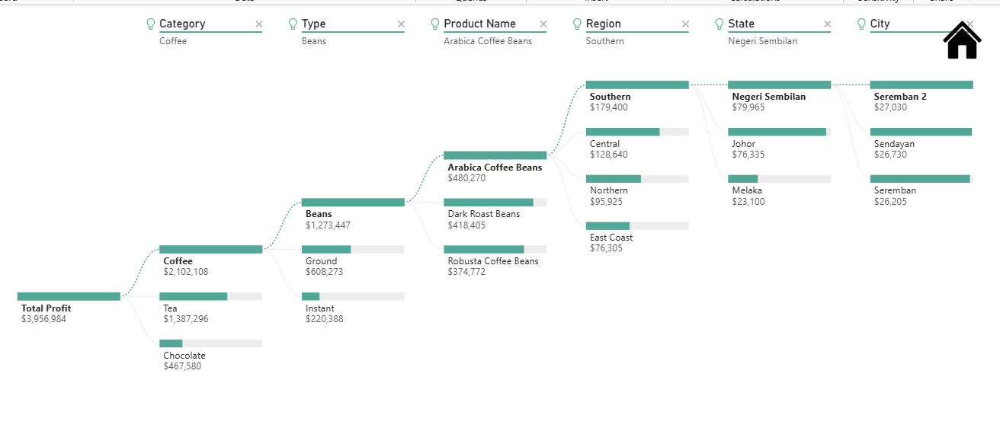

# Coffee Shop Sales Analysis Dashboard

## Project Overview
This project analyzes coffee shop sales data to evaluate revenue performance, product profitability, and key factors influencing profit. An interactive dashboard was built using Power BI to provide insights into sales trends, product performance, and regional profitability.

## Tools Used
- Power BI
- Microsoft Excel
- DAX (Data Analysis Expressions)

## Dataset
The dataset contains transactional sales data including product category, product name, region, price per unit, cost, revenue, and profit.

## Dashboard Report Pages

### 1. Sales Overview
Provides a high-level summary of business performance including total revenue, total profit, and profit margin. The page also visualizes profit trends over time and category contribution across Coffee, Tea, and Chocolate products.

### 2. Product Performance
Analyzes product-level metrics such as revenue, profit, profit margin, and year-over-year growth to identify top-performing and low-performing products.

### 3. Regional & Profit Drivers Analysis
Examines profit distribution across regions and uses Key Influencer analysis to identify factors impacting profitability, including the effect of price per unit on total profit.

## Key Insights
- Total Revenue: $3.6M+
- Total Profit: $975K+
- Coffee products contributed the largest share of total profit.
- Pricing was identified as a key factor influencing profitability.

## Dashboard Preview

### Sales Overview

### Product Performance

### Regional & Profit Drivers Analysis

## Project Objective
The goal of this project is to demonstrate data cleaning, analysis, and visualization skills using Power BI while generating actionable business insights.

## Author
Abilash Maran  
Aspiring Data Analyst | Power BI | SQL | Excel
